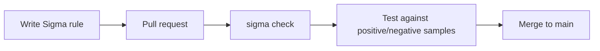

# detection-as-code

A collection of Sigma detection rules for Linux, managed like software: every rule is version-controlled, validated, and tested against real (redacted) log samples before it's accepted.

## Why this project

I built this project to learn detection engineering hands-on, and as a step toward protecting my own Raspberry Pi lab from break-in attempts.

Without detection-as-code, a detection rule is often just text someone edits directly in a security tool. There's no history of what changed or why, nobody reviews it, and nobody checks that it still works afterwards. A small typo can silently stop a rule from ever firing. Keeping rules in Git and testing every change against real log samples fixes that: every change is tracked, reviewed, and proven to work before it's accepted.

## How it works



1. **Write a rule** in Sigma, a vendor-neutral format that can be converted for most SIEMs.
2. **Open a pull request**, so the change can be reviewed before it reaches `main`.
3. **Validate** the rule's structure with `sigma check`.
4. **Test** the rule against two log samples: a *positive* sample containing the attack (the rule must fire) and a *negative* sample with normal activity (the rule must stay quiet). This catches both missed attacks and false alarms.
5. **Merge** only when everything passes.

## Repository structure

```
rules/      Sigma detection rules
samples/    Redacted log samples (positive = should fire, negative = should stay quiet)
tests/      Test runner
.github/    CI pipeline (GitHub Actions)
```

Samples mirror the rules structure: the samples for `rules/linux/sshd/lnx_sshd_invalid_user.yml` live in `samples/linux/sshd/lnx_sshd_invalid_user/`.

## Rules

|         Rule          |                                 Detects                           |        ATT&CK       |
|-----------------------|-------------------------------------------------------------------|---------------------|
| lnx_sshd_invalid_user | SSH login attempts using usernames that don't exist on the system | T1110 (Brute Force) |

## How test data was created

All log samples come from my own Rocky Linux VM. I generated them by attacking my own machine: logging in over SSH as a non-existent user (`ssh fakeuser@localhost`) with wrong passwords until sshd disconnected me, and separately logging in as my real user with a wrong password. The first produced the positive sample, the second the negative one.

Before committing, the samples were redacted with `sed`, because this repository is public. My real username was replaced with `alice` (knowing a valid username is half of what an attacker needs to log in), the hostname with `testhost`, and my local IP with `203.0.113.10`, an address range reserved for documentation that can never belong to a real machine. Every sample was checked with `grep` afterwards to confirm no original values remained.

## Run it locally

```bash
python3.11 -m venv .venv
source .venv/bin/activate
pip install sigma-cli
sigma check rules/
```

## Known limitations

- **One attack triggers many matches.** Sigma matches text case-insensitively by default, so the keyword `Invalid user` also matches the lowercase "invalid user" that appears in most follow-up log lines. In testing, one brute-force attempt produced 11 matches instead of 1. Possible fixes: the `|cased` modifier for exact-case matching, or grouping repeated alerts in the SIEM.
- **Keyword matching only.** The rule doesn't count attempts over time, so it can't tell one typo from a sustained attack. That needs a correlation rule with a threshold.
- **Not running live yet.** Rules are validated and tested here, but not yet deployed to a system that watches logs in real time.

## What I learned

- Detections must be tested against real logs, not written from assumptions. My first draft rule matched only "Failed password" and would have missed half the failed logins, because SSH logs a different line for keyboard-interactive authentication.
- The difference between false positives and false negatives, and why every rule needs both a positive and a negative test.
- How to redact log data safely before publishing it, and how to verify the redaction instead of assuming it worked.
- Practical Git and Python workflow: commits, remotes, `.gitignore`, and isolating tools in a virtual environment.

## Roadmap

- [x] First rule with positive/negative samples
- [x] README
- [ ] Automated test runner
- [ ] GitHub Actions pipeline
- [ ] More rules (e.g. sudo misuse, successful login after many failures)
- [ ] Run rules live against logs from my Raspberry Pi
